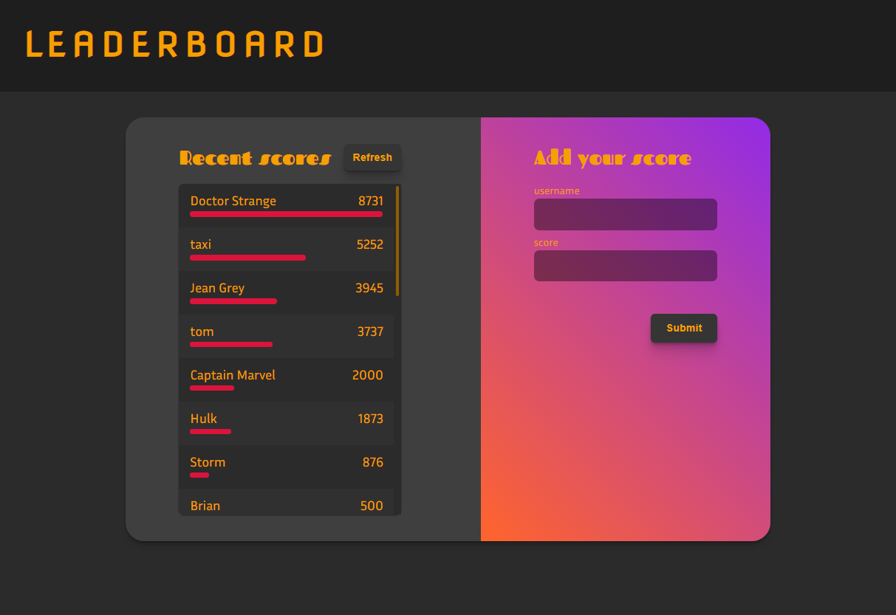

# Leaderboard

> Leaderboard is a website that displays scores submitted by different players. It also allows you to submit your score



Additional description about the project and its features.

## Built With

- JavaScript
- SCSS
- Webpack
- PostCSS

## Getting Started

To get a local copy up and running follow these simple example steps.

```
git clone https://github.com/MrBrN197/Leaderboard.git
```

and then run

```
npm i
npm start
```

## Installation

to build a production version to `dist` folder run

```
npm run build
```

## Authors

👤 **Author1**

- GitHub: [@MrBrN197](https://github.com/MrBrN197)
- Twitter: [@MrBrN197](https://twitter.com/MrBrN197)
- LinkedIn: [LinkedIn](https://www.linkedin.com/in/brian-orora-2b7883a7/)

## 🤝 Contributing

Contributions, issues, and feature requests are welcome!

Feel free to check the [issues page](../../issues/).

## Show your support

Give a ⭐️ if you like this project!

## Acknowledgments

- Leaderboard API
